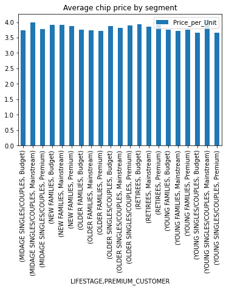

# Quantium

Cristiane de Souza da Silva 

March 2021

## Task 1  - Data Preparation and Customer Analytics

- Creating and interpreting high level summaries of the data

- Finding outliers and removing these (if applicable)

- Checking data formats and correcting (if applicable)


### 1) Examine transaction data 

Look for inconsistencies, missing data across the data set, outliers, correctly identified category items, numeric data across all tables.


```python
import numpy as np, pandas as pd 
import matplotlib.pyplot as plt
import seaborn as sns
```


```python
trans_data =  pd.read_excel('QVI_transaction_data.xlsx')
trans_data
```


<div>
<style scoped>
    .dataframe tbody tr th:only-of-type {
        vertical-align: middle;
    }

    .dataframe tbody tr th {
        vertical-align: top;
    }

    .dataframe thead th {
        text-align: right;
    }
</style>
<table border="1" class="dataframe">
  <thead>
    <tr style="text-align: right;">
      <th></th>
      <th>DATE</th>
      <th>STORE_NBR</th>
      <th>LYLTY_CARD_NBR</th>
      <th>TXN_ID</th>
      <th>PROD_NBR</th>
      <th>PROD_NAME</th>
      <th>PROD_QTY</th>
      <th>TOT_SALES</th>
    </tr>
  </thead>
  <tbody>
    <tr>
      <th>0</th>
      <td>43390</td>
      <td>1</td>
      <td>1000</td>
      <td>1</td>
      <td>5</td>
      <td>Natural Chip        Compny SeaSalt175g</td>
      <td>2</td>
      <td>6.0</td>
    </tr>
    <tr>
      <th>1</th>
      <td>43599</td>
      <td>1</td>
      <td>1307</td>
      <td>348</td>
      <td>66</td>
      <td>CCs Nacho Cheese    175g</td>
      <td>3</td>
      <td>6.3</td>
    </tr>
    <tr>
      <th>2</th>
      <td>43605</td>
      <td>1</td>
      <td>1343</td>
      <td>383</td>
      <td>61</td>
      <td>Smiths Crinkle Cut  Chips Chicken 170g</td>
      <td>2</td>
      <td>2.9</td>
    </tr>
    <tr>
      <th>3</th>
      <td>43329</td>
      <td>2</td>
      <td>2373</td>
      <td>974</td>
      <td>69</td>
      <td>Smiths Chip Thinly  S/Cream&amp;Onion 175g</td>
      <td>5</td>
      <td>15.0</td>
    </tr>
    <tr>
      <th>4</th>
      <td>43330</td>
      <td>2</td>
      <td>2426</td>
      <td>1038</td>
      <td>108</td>
      <td>Kettle Tortilla ChpsHny&amp;Jlpno Chili 150g</td>
      <td>3</td>
      <td>13.8</td>
    </tr>
    <tr>
      <th>...</th>
      <td>...</td>
      <td>...</td>
      <td>...</td>
      <td>...</td>
      <td>...</td>
      <td>...</td>
      <td>...</td>
      <td>...</td>
    </tr>
    <tr>
      <th>264831</th>
      <td>43533</td>
      <td>272</td>
      <td>272319</td>
      <td>270088</td>
      <td>89</td>
      <td>Kettle Sweet Chilli And Sour Cream 175g</td>
      <td>2</td>
      <td>10.8</td>
    </tr>
    <tr>
      <th>264832</th>
      <td>43325</td>
      <td>272</td>
      <td>272358</td>
      <td>270154</td>
      <td>74</td>
      <td>Tostitos Splash Of  Lime 175g</td>
      <td>1</td>
      <td>4.4</td>
    </tr>
    <tr>
      <th>264833</th>
      <td>43410</td>
      <td>272</td>
      <td>272379</td>
      <td>270187</td>
      <td>51</td>
      <td>Doritos Mexicana    170g</td>
      <td>2</td>
      <td>8.8</td>
    </tr>
    <tr>
      <th>264834</th>
      <td>43461</td>
      <td>272</td>
      <td>272379</td>
      <td>270188</td>
      <td>42</td>
      <td>Doritos Corn Chip Mexican Jalapeno 150g</td>
      <td>2</td>
      <td>7.8</td>
    </tr>
    <tr>
      <th>264835</th>
      <td>43365</td>
      <td>272</td>
      <td>272380</td>
      <td>270189</td>
      <td>74</td>
      <td>Tostitos Splash Of  Lime 175g</td>
      <td>2</td>
      <td>8.8</td>
    </tr>
  </tbody>
</table>
<p>264836 rows × 8 columns</p>
</div>


```python
trans_data.info()
```

    <class 'pandas.core.frame.DataFrame'>
    RangeIndex: 264836 entries, 0 to 264835
    Data columns (total 8 columns):
     #   Column          Non-Null Count   Dtype  
    ---  ------          --------------   -----  
     0   DATE            264836 non-null  int64  
     1   STORE_NBR       264836 non-null  int64  
     2   LYLTY_CARD_NBR  264836 non-null  int64  
     3   TXN_ID          264836 non-null  int64  
     4   PROD_NBR        264836 non-null  int64  
     5   PROD_NAME       264836 non-null  object 
     6   PROD_QTY        264836 non-null  int64  
     7   TOT_SALES       264836 non-null  float64
    dtypes: float64(1), int64(6), object(1)
    memory usage: 16.2+ MB


There are 264836 rows and there aren't null  values according to the info table.


### Changing the date format from 5-digit number to datetime


```python
import datetime as dt

trans_data['DATE'] = pd.TimedeltaIndex(trans_data['DATE'], unit='d') + dt.datetime(1900,1,1)
trans_data.head()
```


<div>
<style scoped>
    .dataframe tbody tr th:only-of-type {
        vertical-align: middle;
    }

    .dataframe tbody tr th {
        vertical-align: top;
    }

    .dataframe thead th {
        text-align: right;
    }
</style>
<table border="1" class="dataframe">
  <thead>
    <tr style="text-align: right;">
      <th></th>
      <th>DATE</th>
      <th>STORE_NBR</th>
      <th>LYLTY_CARD_NBR</th>
      <th>TXN_ID</th>
      <th>PROD_NBR</th>
      <th>PROD_NAME</th>
      <th>PROD_QTY</th>
      <th>TOT_SALES</th>
    </tr>
  </thead>
  <tbody>
    <tr>
      <th>0</th>
      <td>2018-10-19</td>
      <td>1</td>
      <td>1000</td>
      <td>1</td>
      <td>5</td>
      <td>Natural Chip        Compny SeaSalt175g</td>
      <td>2</td>
      <td>6.0</td>
    </tr>
    <tr>
      <th>1</th>
      <td>2019-05-16</td>
      <td>1</td>
      <td>1307</td>
      <td>348</td>
      <td>66</td>
      <td>CCs Nacho Cheese    175g</td>
      <td>3</td>
      <td>6.3</td>
    </tr>
    <tr>
      <th>2</th>
      <td>2019-05-22</td>
      <td>1</td>
      <td>1343</td>
      <td>383</td>
      <td>61</td>
      <td>Smiths Crinkle Cut  Chips Chicken 170g</td>
      <td>2</td>
      <td>2.9</td>
    </tr>
    <tr>
      <th>3</th>
      <td>2018-08-19</td>
      <td>2</td>
      <td>2373</td>
      <td>974</td>
      <td>69</td>
      <td>Smiths Chip Thinly  S/Cream&amp;Onion 175g</td>
      <td>5</td>
      <td>15.0</td>
    </tr>
    <tr>
      <th>4</th>
      <td>2018-08-20</td>
      <td>2</td>
      <td>2426</td>
      <td>1038</td>
      <td>108</td>
      <td>Kettle Tortilla ChpsHny&amp;Jlpno Chili 150g</td>
      <td>3</td>
      <td>13.8</td>
    </tr>
  </tbody>
</table>
</div>


```python
trans_data.info()
```

    <class 'pandas.core.frame.DataFrame'>
    RangeIndex: 264836 entries, 0 to 264835
    Data columns (total 8 columns):
     #   Column          Non-Null Count   Dtype         
    ---  ------          --------------   -----         
     0   DATE            264836 non-null  datetime64[ns]
     1   STORE_NBR       264836 non-null  int64         
     2   LYLTY_CARD_NBR  264836 non-null  int64         
     3   TXN_ID          264836 non-null  int64         
     4   PROD_NBR        264836 non-null  int64         
     5   PROD_NAME       264836 non-null  object        
     6   PROD_QTY        264836 non-null  int64         
     7   TOT_SALES       264836 non-null  float64       
    dtypes: datetime64[ns](1), float64(1), int64(5), object(1)
    memory usage: 16.2+ MB


```python
#Sorting the table by date

trans_data = trans_data.sort_values(by='DATE').reset_index(drop=True)
trans_data
```


<div>
<style scoped>
    .dataframe tbody tr th:only-of-type {
        vertical-align: middle;
    }

    .dataframe tbody tr th {
        vertical-align: top;
    }

    .dataframe thead th {
        text-align: right;
    }
</style>
<table border="1" class="dataframe">
  <thead>
    <tr style="text-align: right;">
      <th></th>
      <th>DATE</th>
      <th>STORE_NBR</th>
      <th>LYLTY_CARD_NBR</th>
      <th>TXN_ID</th>
      <th>PROD_NBR</th>
      <th>PROD_NAME</th>
      <th>PROD_QTY</th>
      <th>TOT_SALES</th>
    </tr>
  </thead>
  <tbody>
    <tr>
      <th>0</th>
      <td>2018-07-03</td>
      <td>19</td>
      <td>19205</td>
      <td>16466</td>
      <td>26</td>
      <td>Pringles Sweet&amp;Spcy BBQ 134g</td>
      <td>1</td>
      <td>3.7</td>
    </tr>
    <tr>
      <th>1</th>
      <td>2018-07-03</td>
      <td>189</td>
      <td>189381</td>
      <td>190189</td>
      <td>84</td>
      <td>GrnWves Plus Btroot &amp; Chilli Jam 180g</td>
      <td>1</td>
      <td>3.1</td>
    </tr>
    <tr>
      <th>2</th>
      <td>2018-07-03</td>
      <td>124</td>
      <td>124236</td>
      <td>127984</td>
      <td>104</td>
      <td>Infuzions Thai SweetChili PotatoMix 110g</td>
      <td>1</td>
      <td>3.8</td>
    </tr>
    <tr>
      <th>3</th>
      <td>2018-07-03</td>
      <td>70</td>
      <td>70131</td>
      <td>68241</td>
      <td>60</td>
      <td>Kettle Tortilla ChpsFeta&amp;Garlic 150g</td>
      <td>2</td>
      <td>9.2</td>
    </tr>
    <tr>
      <th>4</th>
      <td>2018-07-03</td>
      <td>33</td>
      <td>33140</td>
      <td>30342</td>
      <td>10</td>
      <td>RRD SR Slow Rst     Pork Belly 150g</td>
      <td>2</td>
      <td>5.4</td>
    </tr>
    <tr>
      <th>...</th>
      <td>...</td>
      <td>...</td>
      <td>...</td>
      <td>...</td>
      <td>...</td>
      <td>...</td>
      <td>...</td>
      <td>...</td>
    </tr>
    <tr>
      <th>264831</th>
      <td>2019-07-02</td>
      <td>97</td>
      <td>97085</td>
      <td>96824</td>
      <td>33</td>
      <td>Cobs Popd Swt/Chlli &amp;Sr/Cream Chips 110g</td>
      <td>2</td>
      <td>7.6</td>
    </tr>
    <tr>
      <th>264832</th>
      <td>2019-07-02</td>
      <td>148</td>
      <td>148317</td>
      <td>148317</td>
      <td>112</td>
      <td>Tyrrells Crisps     Ched &amp; Chives 165g</td>
      <td>1</td>
      <td>4.2</td>
    </tr>
    <tr>
      <th>264833</th>
      <td>2019-07-02</td>
      <td>212</td>
      <td>212068</td>
      <td>210874</td>
      <td>113</td>
      <td>Twisties Chicken270g</td>
      <td>2</td>
      <td>9.2</td>
    </tr>
    <tr>
      <th>264834</th>
      <td>2019-07-02</td>
      <td>55</td>
      <td>55029</td>
      <td>48630</td>
      <td>2</td>
      <td>Cobs Popd Sour Crm  &amp;Chives Chips 110g</td>
      <td>2</td>
      <td>7.6</td>
    </tr>
    <tr>
      <th>264835</th>
      <td>2019-07-02</td>
      <td>247</td>
      <td>247060</td>
      <td>248955</td>
      <td>12</td>
      <td>Natural Chip Co     Tmato Hrb&amp;Spce 175g</td>
      <td>2</td>
      <td>6.0</td>
    </tr>
  </tbody>
</table>
<p>264836 rows × 8 columns</p>
</div>


```python

```

### Keep only the chip's products


```python
### Removing Punctuation from 'PROD_NAME'
trans_data['PROD_NAME'] = trans_data['PROD_NAME'].str.replace(r'[^\w\s]+', '')
trans_data.head()
```


<div>
<style scoped>
    .dataframe tbody tr th:only-of-type {
        vertical-align: middle;
    }

    .dataframe tbody tr th {
        vertical-align: top;
    }

    .dataframe thead th {
        text-align: right;
    }
</style>
<table border="1" class="dataframe">
  <thead>
    <tr style="text-align: right;">
      <th></th>
      <th>DATE</th>
      <th>STORE_NBR</th>
      <th>LYLTY_CARD_NBR</th>
      <th>TXN_ID</th>
      <th>PROD_NBR</th>
      <th>PROD_NAME</th>
      <th>PROD_QTY</th>
      <th>TOT_SALES</th>
    </tr>
  </thead>
  <tbody>
    <tr>
      <th>0</th>
      <td>2018-07-03</td>
      <td>19</td>
      <td>19205</td>
      <td>16466</td>
      <td>26</td>
      <td>Pringles SweetSpcy BBQ 134g</td>
      <td>1</td>
      <td>3.7</td>
    </tr>
    <tr>
      <th>1</th>
      <td>2018-07-03</td>
      <td>189</td>
      <td>189381</td>
      <td>190189</td>
      <td>84</td>
      <td>GrnWves Plus Btroot  Chilli Jam 180g</td>
      <td>1</td>
      <td>3.1</td>
    </tr>
    <tr>
      <th>2</th>
      <td>2018-07-03</td>
      <td>124</td>
      <td>124236</td>
      <td>127984</td>
      <td>104</td>
      <td>Infuzions Thai SweetChili PotatoMix 110g</td>
      <td>1</td>
      <td>3.8</td>
    </tr>
    <tr>
      <th>3</th>
      <td>2018-07-03</td>
      <td>70</td>
      <td>70131</td>
      <td>68241</td>
      <td>60</td>
      <td>Kettle Tortilla ChpsFetaGarlic 150g</td>
      <td>2</td>
      <td>9.2</td>
    </tr>
    <tr>
      <th>4</th>
      <td>2018-07-03</td>
      <td>33</td>
      <td>33140</td>
      <td>30342</td>
      <td>10</td>
      <td>RRD SR Slow Rst     Pork Belly 150g</td>
      <td>2</td>
      <td>5.4</td>
    </tr>
  </tbody>
</table>
</div>


```python
#Remove the entries with the word 'salsa'
chip_data = trans_data[~trans_data.PROD_NAME.str.contains("Salsa")]
chip_data.head()
```


<div>
<style scoped>
    .dataframe tbody tr th:only-of-type {
        vertical-align: middle;
    }

    .dataframe tbody tr th {
        vertical-align: top;
    }

    .dataframe thead th {
        text-align: right;
    }
</style>
<table border="1" class="dataframe">
  <thead>
    <tr style="text-align: right;">
      <th></th>
      <th>DATE</th>
      <th>STORE_NBR</th>
      <th>LYLTY_CARD_NBR</th>
      <th>TXN_ID</th>
      <th>PROD_NBR</th>
      <th>PROD_NAME</th>
      <th>PROD_QTY</th>
      <th>TOT_SALES</th>
    </tr>
  </thead>
  <tbody>
    <tr>
      <th>0</th>
      <td>2018-07-03</td>
      <td>19</td>
      <td>19205</td>
      <td>16466</td>
      <td>26</td>
      <td>Pringles SweetSpcy BBQ 134g</td>
      <td>1</td>
      <td>3.7</td>
    </tr>
    <tr>
      <th>1</th>
      <td>2018-07-03</td>
      <td>189</td>
      <td>189381</td>
      <td>190189</td>
      <td>84</td>
      <td>GrnWves Plus Btroot  Chilli Jam 180g</td>
      <td>1</td>
      <td>3.1</td>
    </tr>
    <tr>
      <th>2</th>
      <td>2018-07-03</td>
      <td>124</td>
      <td>124236</td>
      <td>127984</td>
      <td>104</td>
      <td>Infuzions Thai SweetChili PotatoMix 110g</td>
      <td>1</td>
      <td>3.8</td>
    </tr>
    <tr>
      <th>3</th>
      <td>2018-07-03</td>
      <td>70</td>
      <td>70131</td>
      <td>68241</td>
      <td>60</td>
      <td>Kettle Tortilla ChpsFetaGarlic 150g</td>
      <td>2</td>
      <td>9.2</td>
    </tr>
    <tr>
      <th>4</th>
      <td>2018-07-03</td>
      <td>33</td>
      <td>33140</td>
      <td>30342</td>
      <td>10</td>
      <td>RRD SR Slow Rst     Pork Belly 150g</td>
      <td>2</td>
      <td>5.4</td>
    </tr>
  </tbody>
</table>
</div>


```python
chip_data.describe()
```


<div>
<style scoped>
    .dataframe tbody tr th:only-of-type {
        vertical-align: middle;
    }

    .dataframe tbody tr th {
        vertical-align: top;
    }

    .dataframe thead th {
        text-align: right;
    }
</style>
<table border="1" class="dataframe">
  <thead>
    <tr style="text-align: right;">
      <th></th>
      <th>STORE_NBR</th>
      <th>LYLTY_CARD_NBR</th>
      <th>TXN_ID</th>
      <th>PROD_NBR</th>
      <th>PROD_QTY</th>
      <th>TOT_SALES</th>
    </tr>
  </thead>
  <tbody>
    <tr>
      <th>count</th>
      <td>246742.000000</td>
      <td>2.467420e+05</td>
      <td>2.467420e+05</td>
      <td>246742.000000</td>
      <td>246742.000000</td>
      <td>246742.000000</td>
    </tr>
    <tr>
      <th>mean</th>
      <td>135.051098</td>
      <td>1.355310e+05</td>
      <td>1.351311e+05</td>
      <td>56.351789</td>
      <td>1.908062</td>
      <td>7.321322</td>
    </tr>
    <tr>
      <th>std</th>
      <td>76.787096</td>
      <td>8.071528e+04</td>
      <td>7.814772e+04</td>
      <td>33.695428</td>
      <td>0.659831</td>
      <td>3.077828</td>
    </tr>
    <tr>
      <th>min</th>
      <td>1.000000</td>
      <td>1.000000e+03</td>
      <td>1.000000e+00</td>
      <td>1.000000</td>
      <td>1.000000</td>
      <td>1.700000</td>
    </tr>
    <tr>
      <th>25%</th>
      <td>70.000000</td>
      <td>7.001500e+04</td>
      <td>6.756925e+04</td>
      <td>26.000000</td>
      <td>2.000000</td>
      <td>5.800000</td>
    </tr>
    <tr>
      <th>50%</th>
      <td>130.000000</td>
      <td>1.303670e+05</td>
      <td>1.351830e+05</td>
      <td>53.000000</td>
      <td>2.000000</td>
      <td>7.400000</td>
    </tr>
    <tr>
      <th>75%</th>
      <td>203.000000</td>
      <td>2.030840e+05</td>
      <td>2.026538e+05</td>
      <td>87.000000</td>
      <td>2.000000</td>
      <td>8.800000</td>
    </tr>
    <tr>
      <th>max</th>
      <td>272.000000</td>
      <td>2.373711e+06</td>
      <td>2.415841e+06</td>
      <td>114.000000</td>
      <td>200.000000</td>
      <td>650.000000</td>
    </tr>
  </tbody>
</table>
</div>


```python
#Findiding Outliers

plt.figure(figsize=(8,5))
sns.boxplot(x=chip_data["PROD_QTY"])
```


    <AxesSubplot:xlabel='PROD_QTY'>


    

    


```python
#Information about the outlier
chip_data[chip_data["PROD_QTY"]>175]
```


<div>
<style scoped>
    .dataframe tbody tr th:only-of-type {
        vertical-align: middle;
    }

    .dataframe tbody tr th {
        vertical-align: top;
    }

    .dataframe thead th {
        text-align: right;
    }
</style>
<table border="1" class="dataframe">
  <thead>
    <tr style="text-align: right;">
      <th></th>
      <th>DATE</th>
      <th>STORE_NBR</th>
      <th>LYLTY_CARD_NBR</th>
      <th>TXN_ID</th>
      <th>PROD_NBR</th>
      <th>PROD_NAME</th>
      <th>PROD_QTY</th>
      <th>TOT_SALES</th>
    </tr>
  </thead>
  <tbody>
    <tr>
      <th>35771</th>
      <td>2018-08-21</td>
      <td>226</td>
      <td>226000</td>
      <td>226201</td>
      <td>4</td>
      <td>Dorito Corn Chp     Supreme 380g</td>
      <td>200</td>
      <td>650.0</td>
    </tr>
    <tr>
      <th>234962</th>
      <td>2019-05-22</td>
      <td>226</td>
      <td>226000</td>
      <td>226210</td>
      <td>4</td>
      <td>Dorito Corn Chp     Supreme 380g</td>
      <td>200</td>
      <td>650.0</td>
    </tr>
  </tbody>
</table>
</div>


```python
chip_data[chip_data["LYLTY_CARD_NBR"]==226000]
```


<div>
<style scoped>
    .dataframe tbody tr th:only-of-type {
        vertical-align: middle;
    }

    .dataframe tbody tr th {
        vertical-align: top;
    }

    .dataframe thead th {
        text-align: right;
    }
</style>
<table border="1" class="dataframe">
  <thead>
    <tr style="text-align: right;">
      <th></th>
      <th>DATE</th>
      <th>STORE_NBR</th>
      <th>LYLTY_CARD_NBR</th>
      <th>TXN_ID</th>
      <th>PROD_NBR</th>
      <th>PROD_NAME</th>
      <th>PROD_QTY</th>
      <th>TOT_SALES</th>
    </tr>
  </thead>
  <tbody>
    <tr>
      <th>35771</th>
      <td>2018-08-21</td>
      <td>226</td>
      <td>226000</td>
      <td>226201</td>
      <td>4</td>
      <td>Dorito Corn Chp     Supreme 380g</td>
      <td>200</td>
      <td>650.0</td>
    </tr>
    <tr>
      <th>234962</th>
      <td>2019-05-22</td>
      <td>226</td>
      <td>226000</td>
      <td>226210</td>
      <td>4</td>
      <td>Dorito Corn Chp     Supreme 380g</td>
      <td>200</td>
      <td>650.0</td>
    </tr>
  </tbody>
</table>
</div>


The customer '226000' has done only two transactions and they are of 200 Doritos. 
This customer will be removed.


```python
#Removing the customer ' 226000'
chip_data=chip_data.drop(chip_data[chip_data["LYLTY_CARD_NBR"]==226000].index)
chip_data
```


<div>
<style scoped>
    .dataframe tbody tr th:only-of-type {
        vertical-align: middle;
    }

    .dataframe tbody tr th {
        vertical-align: top;
    }

    .dataframe thead th {
        text-align: right;
    }
</style>
<table border="1" class="dataframe">
  <thead>
    <tr style="text-align: right;">
      <th></th>
      <th>DATE</th>
      <th>STORE_NBR</th>
      <th>LYLTY_CARD_NBR</th>
      <th>TXN_ID</th>
      <th>PROD_NBR</th>
      <th>PROD_NAME</th>
      <th>PROD_QTY</th>
      <th>TOT_SALES</th>
    </tr>
  </thead>
  <tbody>
    <tr>
      <th>0</th>
      <td>2018-07-03</td>
      <td>19</td>
      <td>19205</td>
      <td>16466</td>
      <td>26</td>
      <td>Pringles SweetSpcy BBQ 134g</td>
      <td>1</td>
      <td>3.7</td>
    </tr>
    <tr>
      <th>1</th>
      <td>2018-07-03</td>
      <td>189</td>
      <td>189381</td>
      <td>190189</td>
      <td>84</td>
      <td>GrnWves Plus Btroot  Chilli Jam 180g</td>
      <td>1</td>
      <td>3.1</td>
    </tr>
    <tr>
      <th>2</th>
      <td>2018-07-03</td>
      <td>124</td>
      <td>124236</td>
      <td>127984</td>
      <td>104</td>
      <td>Infuzions Thai SweetChili PotatoMix 110g</td>
      <td>1</td>
      <td>3.8</td>
    </tr>
    <tr>
      <th>3</th>
      <td>2018-07-03</td>
      <td>70</td>
      <td>70131</td>
      <td>68241</td>
      <td>60</td>
      <td>Kettle Tortilla ChpsFetaGarlic 150g</td>
      <td>2</td>
      <td>9.2</td>
    </tr>
    <tr>
      <th>4</th>
      <td>2018-07-03</td>
      <td>33</td>
      <td>33140</td>
      <td>30342</td>
      <td>10</td>
      <td>RRD SR Slow Rst     Pork Belly 150g</td>
      <td>2</td>
      <td>5.4</td>
    </tr>
    <tr>
      <th>...</th>
      <td>...</td>
      <td>...</td>
      <td>...</td>
      <td>...</td>
      <td>...</td>
      <td>...</td>
      <td>...</td>
      <td>...</td>
    </tr>
    <tr>
      <th>264831</th>
      <td>2019-07-02</td>
      <td>97</td>
      <td>97085</td>
      <td>96824</td>
      <td>33</td>
      <td>Cobs Popd SwtChlli SrCream Chips 110g</td>
      <td>2</td>
      <td>7.6</td>
    </tr>
    <tr>
      <th>264832</th>
      <td>2019-07-02</td>
      <td>148</td>
      <td>148317</td>
      <td>148317</td>
      <td>112</td>
      <td>Tyrrells Crisps     Ched  Chives 165g</td>
      <td>1</td>
      <td>4.2</td>
    </tr>
    <tr>
      <th>264833</th>
      <td>2019-07-02</td>
      <td>212</td>
      <td>212068</td>
      <td>210874</td>
      <td>113</td>
      <td>Twisties Chicken270g</td>
      <td>2</td>
      <td>9.2</td>
    </tr>
    <tr>
      <th>264834</th>
      <td>2019-07-02</td>
      <td>55</td>
      <td>55029</td>
      <td>48630</td>
      <td>2</td>
      <td>Cobs Popd Sour Crm  Chives Chips 110g</td>
      <td>2</td>
      <td>7.6</td>
    </tr>
    <tr>
      <th>264835</th>
      <td>2019-07-02</td>
      <td>247</td>
      <td>247060</td>
      <td>248955</td>
      <td>12</td>
      <td>Natural Chip Co     Tmato HrbSpce 175g</td>
      <td>2</td>
      <td>6.0</td>
    </tr>
  </tbody>
</table>
<p>246740 rows × 8 columns</p>
</div>


```python
#Creating two new columns derivided from PROD_NAME : PROD and SIZE
chip_data['PROD'], chip_data['SIZE'] = chip_data.loc[:,'PROD_NAME'].str.split('(?<=\\D)(?=\\d)').str

chip_data.head()
```

    <ipython-input-14-c20b0452968c>:2: FutureWarning: Columnar iteration over characters will be deprecated in future releases.
      chip_data['PROD'], chip_data['SIZE'] = chip_data.loc[:,'PROD_NAME'].str.split('(?<=\\D)(?=\\d)').str


<div>
<style scoped>
    .dataframe tbody tr th:only-of-type {
        vertical-align: middle;
    }

    .dataframe tbody tr th {
        vertical-align: top;
    }

    .dataframe thead th {
        text-align: right;
    }
</style>
<table border="1" class="dataframe">
  <thead>
    <tr style="text-align: right;">
      <th></th>
      <th>DATE</th>
      <th>STORE_NBR</th>
      <th>LYLTY_CARD_NBR</th>
      <th>TXN_ID</th>
      <th>PROD_NBR</th>
      <th>PROD_NAME</th>
      <th>PROD_QTY</th>
      <th>TOT_SALES</th>
      <th>PROD</th>
      <th>SIZE</th>
    </tr>
  </thead>
  <tbody>
    <tr>
      <th>0</th>
      <td>2018-07-03</td>
      <td>19</td>
      <td>19205</td>
      <td>16466</td>
      <td>26</td>
      <td>Pringles SweetSpcy BBQ 134g</td>
      <td>1</td>
      <td>3.7</td>
      <td>Pringles SweetSpcy BBQ</td>
      <td>134g</td>
    </tr>
    <tr>
      <th>1</th>
      <td>2018-07-03</td>
      <td>189</td>
      <td>189381</td>
      <td>190189</td>
      <td>84</td>
      <td>GrnWves Plus Btroot  Chilli Jam 180g</td>
      <td>1</td>
      <td>3.1</td>
      <td>GrnWves Plus Btroot  Chilli Jam</td>
      <td>180g</td>
    </tr>
    <tr>
      <th>2</th>
      <td>2018-07-03</td>
      <td>124</td>
      <td>124236</td>
      <td>127984</td>
      <td>104</td>
      <td>Infuzions Thai SweetChili PotatoMix 110g</td>
      <td>1</td>
      <td>3.8</td>
      <td>Infuzions Thai SweetChili PotatoMix</td>
      <td>110g</td>
    </tr>
    <tr>
      <th>3</th>
      <td>2018-07-03</td>
      <td>70</td>
      <td>70131</td>
      <td>68241</td>
      <td>60</td>
      <td>Kettle Tortilla ChpsFetaGarlic 150g</td>
      <td>2</td>
      <td>9.2</td>
      <td>Kettle Tortilla ChpsFetaGarlic</td>
      <td>150g</td>
    </tr>
    <tr>
      <th>4</th>
      <td>2018-07-03</td>
      <td>33</td>
      <td>33140</td>
      <td>30342</td>
      <td>10</td>
      <td>RRD SR Slow Rst     Pork Belly 150g</td>
      <td>2</td>
      <td>5.4</td>
      <td>RRD SR Slow Rst     Pork Belly</td>
      <td>150g</td>
    </tr>
  </tbody>
</table>
</div>


```python
chip_data.nunique()
```


    DATE                 364
    STORE_NBR            271
    LYLTY_CARD_NBR     71287
    TXN_ID            245255
    PROD_NBR             105
    PROD_NAME            105
    PROD_QTY               5
    TOT_SALES            104
    PROD                 105
    SIZE                  23
    dtype: int64


```python
chip_data["SIZE"].unique()
```


    array(['134g', '180g', '110g', '150g', '175g', '150G', '160g', '170g',
           '380g', '165g', '250g', '270g', '210G', '175G', '125g',
           '135g Swt Pot Sea Salt', '90g', '200g', '70g', '330g', '220g',
           '210g', '190g'], dtype=object)


```python
# Changing '135g'
chip_data["SIZE"]=chip_data["SIZE"].replace('135g Swt Pot Sea Salt', '135g')

```


```python
chip_data["SIZE"].unique()
```


    array(['134g', '180g', '110g', '150g', '175g', '150G', '160g', '170g',
           '380g', '165g', '250g', '270g', '210G', '175G', '125g', '135g',
           '90g', '200g', '70g', '330g', '220g', '210g', '190g'], dtype=object)


### Transactions by Date


```python
chip_data.groupby('DATE')['TXN_ID'].count()
```


    DATE
    2018-07-03    663
    2018-07-04    650
    2018-07-05    674
    2018-07-06    669
    2018-07-07    660
                 ... 
    2019-06-28    657
    2019-06-29    669
    2019-06-30    673
    2019-07-01    703
    2019-07-02    704
    Name: TXN_ID, Length: 364, dtype: int64


```python
plt.figure(figsize=(10, 6))
chip_data.groupby('DATE')['TXN_ID'].count().plot(kind="line")
plt.title('Transaction by Date ')
plt.ylabel('Total Transactions')
plt.show()
```


    

    


There is a growth os sales on December due to the Christmas period. 


```python
dec_mask = chip_data['DATE'].map(lambda x: x.month) == 12
chip_data[dec_mask]
```


<div>
<style scoped>
    .dataframe tbody tr th:only-of-type {
        vertical-align: middle;
    }

    .dataframe tbody tr th {
        vertical-align: top;
    }

    .dataframe thead th {
        text-align: right;
    }
</style>
<table border="1" class="dataframe">
  <thead>
    <tr style="text-align: right;">
      <th></th>
      <th>DATE</th>
      <th>STORE_NBR</th>
      <th>LYLTY_CARD_NBR</th>
      <th>TXN_ID</th>
      <th>PROD_NBR</th>
      <th>PROD_NAME</th>
      <th>PROD_QTY</th>
      <th>TOT_SALES</th>
      <th>PROD</th>
      <th>SIZE</th>
    </tr>
  </thead>
  <tbody>
    <tr>
      <th>109383</th>
      <td>2018-12-01</td>
      <td>49</td>
      <td>49376</td>
      <td>46061</td>
      <td>47</td>
      <td>Doritos Corn Chips  Original 170g</td>
      <td>2</td>
      <td>8.8</td>
      <td>Doritos Corn Chips  Original</td>
      <td>170g</td>
    </tr>
    <tr>
      <th>109384</th>
      <td>2018-12-01</td>
      <td>36</td>
      <td>36206</td>
      <td>32807</td>
      <td>4</td>
      <td>Dorito Corn Chp     Supreme 380g</td>
      <td>2</td>
      <td>13.0</td>
      <td>Dorito Corn Chp     Supreme</td>
      <td>380g</td>
    </tr>
    <tr>
      <th>109385</th>
      <td>2018-12-01</td>
      <td>173</td>
      <td>173157</td>
      <td>174557</td>
      <td>89</td>
      <td>Kettle Sweet Chilli And Sour Cream 175g</td>
      <td>2</td>
      <td>10.8</td>
      <td>Kettle Sweet Chilli And Sour Cream</td>
      <td>175g</td>
    </tr>
    <tr>
      <th>109386</th>
      <td>2018-12-01</td>
      <td>229</td>
      <td>229065</td>
      <td>230746</td>
      <td>8</td>
      <td>Smiths Crinkle Cut  Chips Original 170g</td>
      <td>2</td>
      <td>5.8</td>
      <td>Smiths Crinkle Cut  Chips Original</td>
      <td>170g</td>
    </tr>
    <tr>
      <th>109387</th>
      <td>2018-12-01</td>
      <td>62</td>
      <td>62021</td>
      <td>57891</td>
      <td>54</td>
      <td>CCs Original 175g</td>
      <td>2</td>
      <td>4.2</td>
      <td>CCs Original</td>
      <td>175g</td>
    </tr>
    <tr>
      <th>...</th>
      <td>...</td>
      <td>...</td>
      <td>...</td>
      <td>...</td>
      <td>...</td>
      <td>...</td>
      <td>...</td>
      <td>...</td>
      <td>...</td>
      <td>...</td>
    </tr>
    <tr>
      <th>132231</th>
      <td>2018-12-31</td>
      <td>113</td>
      <td>113059</td>
      <td>115757</td>
      <td>95</td>
      <td>Sunbites Whlegrn    Crisps FrchOnin 90g</td>
      <td>2</td>
      <td>3.4</td>
      <td>Sunbites Whlegrn    Crisps FrchOnin</td>
      <td>90g</td>
    </tr>
    <tr>
      <th>132232</th>
      <td>2018-12-31</td>
      <td>72</td>
      <td>72316</td>
      <td>71992</td>
      <td>113</td>
      <td>Twisties Chicken270g</td>
      <td>2</td>
      <td>9.2</td>
      <td>Twisties Chicken</td>
      <td>270g</td>
    </tr>
    <tr>
      <th>132233</th>
      <td>2018-12-31</td>
      <td>203</td>
      <td>203134</td>
      <td>202849</td>
      <td>17</td>
      <td>Kettle Sensations   BBQMaple 150g</td>
      <td>2</td>
      <td>9.2</td>
      <td>Kettle Sensations   BBQMaple</td>
      <td>150g</td>
    </tr>
    <tr>
      <th>132234</th>
      <td>2018-12-31</td>
      <td>184</td>
      <td>184230</td>
      <td>187770</td>
      <td>66</td>
      <td>CCs Nacho Cheese    175g</td>
      <td>2</td>
      <td>4.2</td>
      <td>CCs Nacho Cheese</td>
      <td>175g</td>
    </tr>
    <tr>
      <th>132235</th>
      <td>2018-12-31</td>
      <td>227</td>
      <td>227185</td>
      <td>229394</td>
      <td>88</td>
      <td>Kettle Honey Soy    Chicken 175g</td>
      <td>2</td>
      <td>10.8</td>
      <td>Kettle Honey Soy    Chicken</td>
      <td>175g</td>
    </tr>
  </tbody>
</table>
<p>21244 rows × 10 columns</p>
</div>


```python
# Information about December
plt.figure(figsize=(10, 6))
chip_data[dec_mask].groupby('DATE')['TXN_ID'].count().plot(kind="line")
plt.title('Transactions on December ')
plt.ylabel('Total Transactions')
plt.show()
```


    

    


```python
#Pack Size Histogram
plt.figure(figsize=(15,5))
chip_data["SIZE"].hist(bins=50)
plt.title('Pack Size Histogram ')
plt.show()
```


    

    


```python
#Clear brand names

chip_data['PROD'] = chip_data['PROD'].replace('Red','RRD')
chip_data['PROD'] = chip_data['PROD'].replace('SNBTS','SUNBITES')
chip_data['PROD'] = chip_data['PROD'].replace('infzns','Infuzions')
chip_data['PROD'] = chip_data['PROD'].replace('WW','woolworths')
chip_data['PROD'] = chip_data['PROD'].replace('Smith','Smiths')
chip_data['PROD'] = chip_data['PROD'].replace('NCC','Natural')
chip_data['PROD'] = chip_data['PROD'].replace('Dorito','Doritos')
chip_data['PROD'] = chip_data['PROD'].replace('Grain','GrnWves')
chip_data['PROD'].value_counts()

```


    Kettle Mozzarella   Basil  Pesto        3304
    Kettle Tortilla ChpsHnyJlpno Chili      3296
    Cobs Popd SwtChlli SrCream Chips        3269
    Tyrrells Crisps     Ched  Chives        3268
    Cobs Popd Sea Salt  Chips               3265
                                            ... 
    Sunbites Whlegrn    Crisps FrchOnin     1432
    RRD Pc Sea Salt                         1431
    NCC Sour Cream     Garden Chives        1419
    French Fries Potato Chips               1418
    WW Crinkle Cut      Original            1410
    Name: PROD, Length: 105, dtype: int64


```python

```

### 2) Examine Customer Data 


```python
cust_data =  pd.read_csv('QVI_purchase_behaviour.csv')
cust_data.head()
```


<div>
<style scoped>
    .dataframe tbody tr th:only-of-type {
        vertical-align: middle;
    }

    .dataframe tbody tr th {
        vertical-align: top;
    }

    .dataframe thead th {
        text-align: right;
    }
</style>
<table border="1" class="dataframe">
  <thead>
    <tr style="text-align: right;">
      <th></th>
      <th>LYLTY_CARD_NBR</th>
      <th>LIFESTAGE</th>
      <th>PREMIUM_CUSTOMER</th>
    </tr>
  </thead>
  <tbody>
    <tr>
      <th>0</th>
      <td>1000</td>
      <td>YOUNG SINGLES/COUPLES</td>
      <td>Premium</td>
    </tr>
    <tr>
      <th>1</th>
      <td>1002</td>
      <td>YOUNG SINGLES/COUPLES</td>
      <td>Mainstream</td>
    </tr>
    <tr>
      <th>2</th>
      <td>1003</td>
      <td>YOUNG FAMILIES</td>
      <td>Budget</td>
    </tr>
    <tr>
      <th>3</th>
      <td>1004</td>
      <td>OLDER SINGLES/COUPLES</td>
      <td>Mainstream</td>
    </tr>
    <tr>
      <th>4</th>
      <td>1005</td>
      <td>MIDAGE SINGLES/COUPLES</td>
      <td>Mainstream</td>
    </tr>
  </tbody>
</table>
</div>


```python
cust_data.info()
```

    <class 'pandas.core.frame.DataFrame'>
    RangeIndex: 72637 entries, 0 to 72636
    Data columns (total 3 columns):
     #   Column            Non-Null Count  Dtype 
    ---  ------            --------------  ----- 
     0   LYLTY_CARD_NBR    72637 non-null  int64 
     1   LIFESTAGE         72637 non-null  object
     2   PREMIUM_CUSTOMER  72637 non-null  object
    dtypes: int64(1), object(2)
    memory usage: 1.7+ MB


```python
cust_data.isnull().sum()
```


    LYLTY_CARD_NBR      0
    LIFESTAGE           0
    PREMIUM_CUSTOMER    0
    dtype: int64


```python
cust_data.nunique()
```


    LYLTY_CARD_NBR      72637
    LIFESTAGE               7
    PREMIUM_CUSTOMER        3
    dtype: int64


```python
cust_data['LIFESTAGE'].value_counts()
```


    RETIREES                  14805
    OLDER SINGLES/COUPLES     14609
    YOUNG SINGLES/COUPLES     14441
    OLDER FAMILIES             9780
    YOUNG FAMILIES             9178
    MIDAGE SINGLES/COUPLES     7275
    NEW FAMILIES               2549
    Name: LIFESTAGE, dtype: int64


```python
#Joinning the two datas
customer_chip = pd.merge(chip_data, cust_data, on="LYLTY_CARD_NBR")

#customer_chip = chip_data.join(cust_data, how="inner")

customer_chip


```


<div>
<style scoped>
    .dataframe tbody tr th:only-of-type {
        vertical-align: middle;
    }

    .dataframe tbody tr th {
        vertical-align: top;
    }

    .dataframe thead th {
        text-align: right;
    }
</style>
<table border="1" class="dataframe">
  <thead>
    <tr style="text-align: right;">
      <th></th>
      <th>DATE</th>
      <th>STORE_NBR</th>
      <th>LYLTY_CARD_NBR</th>
      <th>TXN_ID</th>
      <th>PROD_NBR</th>
      <th>PROD_NAME</th>
      <th>PROD_QTY</th>
      <th>TOT_SALES</th>
      <th>PROD</th>
      <th>SIZE</th>
      <th>LIFESTAGE</th>
      <th>PREMIUM_CUSTOMER</th>
    </tr>
  </thead>
  <tbody>
    <tr>
      <th>0</th>
      <td>2018-07-03</td>
      <td>19</td>
      <td>19205</td>
      <td>16466</td>
      <td>26</td>
      <td>Pringles SweetSpcy BBQ 134g</td>
      <td>1</td>
      <td>3.7</td>
      <td>Pringles SweetSpcy BBQ</td>
      <td>134g</td>
      <td>OLDER SINGLES/COUPLES</td>
      <td>Mainstream</td>
    </tr>
    <tr>
      <th>1</th>
      <td>2018-08-21</td>
      <td>19</td>
      <td>19205</td>
      <td>16467</td>
      <td>63</td>
      <td>Kettle 135g Swt Pot Sea Salt</td>
      <td>2</td>
      <td>8.4</td>
      <td>Kettle</td>
      <td>135g</td>
      <td>OLDER SINGLES/COUPLES</td>
      <td>Mainstream</td>
    </tr>
    <tr>
      <th>2</th>
      <td>2018-09-20</td>
      <td>19</td>
      <td>19205</td>
      <td>16468</td>
      <td>88</td>
      <td>Kettle Honey Soy    Chicken 175g</td>
      <td>2</td>
      <td>10.8</td>
      <td>Kettle Honey Soy    Chicken</td>
      <td>175g</td>
      <td>OLDER SINGLES/COUPLES</td>
      <td>Mainstream</td>
    </tr>
    <tr>
      <th>3</th>
      <td>2018-07-03</td>
      <td>189</td>
      <td>189381</td>
      <td>190189</td>
      <td>84</td>
      <td>GrnWves Plus Btroot  Chilli Jam 180g</td>
      <td>1</td>
      <td>3.1</td>
      <td>GrnWves Plus Btroot  Chilli Jam</td>
      <td>180g</td>
      <td>OLDER FAMILIES</td>
      <td>Mainstream</td>
    </tr>
    <tr>
      <th>4</th>
      <td>2018-07-03</td>
      <td>124</td>
      <td>124236</td>
      <td>127984</td>
      <td>104</td>
      <td>Infuzions Thai SweetChili PotatoMix 110g</td>
      <td>1</td>
      <td>3.8</td>
      <td>Infuzions Thai SweetChili PotatoMix</td>
      <td>110g</td>
      <td>OLDER FAMILIES</td>
      <td>Budget</td>
    </tr>
    <tr>
      <th>...</th>
      <td>...</td>
      <td>...</td>
      <td>...</td>
      <td>...</td>
      <td>...</td>
      <td>...</td>
      <td>...</td>
      <td>...</td>
      <td>...</td>
      <td>...</td>
      <td>...</td>
      <td>...</td>
    </tr>
    <tr>
      <th>246735</th>
      <td>2019-07-02</td>
      <td>181</td>
      <td>181207</td>
      <td>183425</td>
      <td>25</td>
      <td>Pringles SourCream  Onion 134g</td>
      <td>2</td>
      <td>7.4</td>
      <td>Pringles SourCream  Onion</td>
      <td>134g</td>
      <td>MIDAGE SINGLES/COUPLES</td>
      <td>Mainstream</td>
    </tr>
    <tr>
      <th>246736</th>
      <td>2019-07-02</td>
      <td>28</td>
      <td>28150</td>
      <td>25420</td>
      <td>60</td>
      <td>Kettle Tortilla ChpsFetaGarlic 150g</td>
      <td>2</td>
      <td>9.2</td>
      <td>Kettle Tortilla ChpsFetaGarlic</td>
      <td>150g</td>
      <td>YOUNG SINGLES/COUPLES</td>
      <td>Budget</td>
    </tr>
    <tr>
      <th>246737</th>
      <td>2019-07-02</td>
      <td>99</td>
      <td>99020</td>
      <td>98242</td>
      <td>23</td>
      <td>Cheezels Cheese 330g</td>
      <td>1</td>
      <td>5.7</td>
      <td>Cheezels Cheese</td>
      <td>330g</td>
      <td>RETIREES</td>
      <td>Premium</td>
    </tr>
    <tr>
      <th>246738</th>
      <td>2019-07-02</td>
      <td>38</td>
      <td>38458</td>
      <td>34529</td>
      <td>48</td>
      <td>Red Rock Deli Sp    Salt  Truffle 150G</td>
      <td>2</td>
      <td>5.4</td>
      <td>Red Rock Deli Sp    Salt  Truffle</td>
      <td>150G</td>
      <td>OLDER SINGLES/COUPLES</td>
      <td>Mainstream</td>
    </tr>
    <tr>
      <th>246739</th>
      <td>2019-07-02</td>
      <td>186</td>
      <td>186152</td>
      <td>188545</td>
      <td>51</td>
      <td>Doritos Mexicana    170g</td>
      <td>2</td>
      <td>8.8</td>
      <td>Doritos Mexicana</td>
      <td>170g</td>
      <td>YOUNG SINGLES/COUPLES</td>
      <td>Mainstream</td>
    </tr>
  </tbody>
</table>
<p>246740 rows × 12 columns</p>
</div>


```python
customer_chip.info()
```

    <class 'pandas.core.frame.DataFrame'>
    Int64Index: 246740 entries, 0 to 246739
    Data columns (total 12 columns):
     #   Column            Non-Null Count   Dtype         
    ---  ------            --------------   -----         
     0   DATE              246740 non-null  datetime64[ns]
     1   STORE_NBR         246740 non-null  int64         
     2   LYLTY_CARD_NBR    246740 non-null  int64         
     3   TXN_ID            246740 non-null  int64         
     4   PROD_NBR          246740 non-null  int64         
     5   PROD_NAME         246740 non-null  object        
     6   PROD_QTY          246740 non-null  int64         
     7   TOT_SALES         246740 non-null  float64       
     8   PROD              246740 non-null  object        
     9   SIZE              246740 non-null  object        
     10  LIFESTAGE         246740 non-null  object        
     11  PREMIUM_CUSTOMER  246740 non-null  object        
    dtypes: datetime64[ns](1), float64(1), int64(5), object(5)
    memory usage: 24.5+ MB


```python
customer_chip.nunique()
```


    DATE                   364
    STORE_NBR              271
    LYLTY_CARD_NBR       71287
    TXN_ID              245255
    PROD_NBR               105
    PROD_NAME              105
    PROD_QTY                 5
    TOT_SALES              104
    PROD                   105
    SIZE                    23
    LIFESTAGE                7
    PREMIUM_CUSTOMER         3
    dtype: int64


### Who spends the most on chips (total sales), describing customers by lifestage and how premium their general purchasing behaviour is.


```python
customer_chip['mean'] = customer_chip['TOT_SALES']/customer_chip['PROD_QTY']
```


```python
#Quantity of sales by premium customer !!!!!!!

sales_life = customer_chip.groupby(['LIFESTAGE','PREMIUM_CUSTOMER']).TOT_SALES.sum().reset_index()
sales_life
```


<div>
<style scoped>
    .dataframe tbody tr th:only-of-type {
        vertical-align: middle;
    }

    .dataframe tbody tr th {
        vertical-align: top;
    }

    .dataframe thead th {
        text-align: right;
    }
</style>
<table border="1" class="dataframe">
  <thead>
    <tr style="text-align: right;">
      <th></th>
      <th>LIFESTAGE</th>
      <th>PREMIUM_CUSTOMER</th>
      <th>TOT_SALES</th>
    </tr>
  </thead>
  <tbody>
    <tr>
      <th>0</th>
      <td>MIDAGE SINGLES/COUPLES</td>
      <td>Budget</td>
      <td>33345.70</td>
    </tr>
    <tr>
      <th>1</th>
      <td>MIDAGE SINGLES/COUPLES</td>
      <td>Mainstream</td>
      <td>84734.25</td>
    </tr>
    <tr>
      <th>2</th>
      <td>MIDAGE SINGLES/COUPLES</td>
      <td>Premium</td>
      <td>54443.85</td>
    </tr>
    <tr>
      <th>3</th>
      <td>NEW FAMILIES</td>
      <td>Budget</td>
      <td>20607.45</td>
    </tr>
    <tr>
      <th>4</th>
      <td>NEW FAMILIES</td>
      <td>Mainstream</td>
      <td>15979.70</td>
    </tr>
    <tr>
      <th>5</th>
      <td>NEW FAMILIES</td>
      <td>Premium</td>
      <td>10760.80</td>
    </tr>
    <tr>
      <th>6</th>
      <td>OLDER FAMILIES</td>
      <td>Budget</td>
      <td>156863.75</td>
    </tr>
    <tr>
      <th>7</th>
      <td>OLDER FAMILIES</td>
      <td>Mainstream</td>
      <td>96413.55</td>
    </tr>
    <tr>
      <th>8</th>
      <td>OLDER FAMILIES</td>
      <td>Premium</td>
      <td>75242.60</td>
    </tr>
    <tr>
      <th>9</th>
      <td>OLDER SINGLES/COUPLES</td>
      <td>Budget</td>
      <td>127833.60</td>
    </tr>
    <tr>
      <th>10</th>
      <td>OLDER SINGLES/COUPLES</td>
      <td>Mainstream</td>
      <td>124648.50</td>
    </tr>
    <tr>
      <th>11</th>
      <td>OLDER SINGLES/COUPLES</td>
      <td>Premium</td>
      <td>123537.55</td>
    </tr>
    <tr>
      <th>12</th>
      <td>RETIREES</td>
      <td>Budget</td>
      <td>105916.30</td>
    </tr>
    <tr>
      <th>13</th>
      <td>RETIREES</td>
      <td>Mainstream</td>
      <td>145168.95</td>
    </tr>
    <tr>
      <th>14</th>
      <td>RETIREES</td>
      <td>Premium</td>
      <td>91296.65</td>
    </tr>
    <tr>
      <th>15</th>
      <td>YOUNG FAMILIES</td>
      <td>Budget</td>
      <td>129717.95</td>
    </tr>
    <tr>
      <th>16</th>
      <td>YOUNG FAMILIES</td>
      <td>Mainstream</td>
      <td>86338.25</td>
    </tr>
    <tr>
      <th>17</th>
      <td>YOUNG FAMILIES</td>
      <td>Premium</td>
      <td>78571.70</td>
    </tr>
    <tr>
      <th>18</th>
      <td>YOUNG SINGLES/COUPLES</td>
      <td>Budget</td>
      <td>57122.10</td>
    </tr>
    <tr>
      <th>19</th>
      <td>YOUNG SINGLES/COUPLES</td>
      <td>Mainstream</td>
      <td>147582.20</td>
    </tr>
    <tr>
      <th>20</th>
      <td>YOUNG SINGLES/COUPLES</td>
      <td>Premium</td>
      <td>39052.30</td>
    </tr>
  </tbody>
</table>
</div>


```python
sales_life_pivot = sales_life.pivot(index='PREMIUM_CUSTOMER', columns='LIFESTAGE', values='TOT_SALES')
sales_life_pivot
```


<div>
<style scoped>
    .dataframe tbody tr th:only-of-type {
        vertical-align: middle;
    }

    .dataframe tbody tr th {
        vertical-align: top;
    }

    .dataframe thead th {
        text-align: right;
    }
</style>
<table border="1" class="dataframe">
  <thead>
    <tr style="text-align: right;">
      <th>LIFESTAGE</th>
      <th>MIDAGE SINGLES/COUPLES</th>
      <th>NEW FAMILIES</th>
      <th>OLDER FAMILIES</th>
      <th>OLDER SINGLES/COUPLES</th>
      <th>RETIREES</th>
      <th>YOUNG FAMILIES</th>
      <th>YOUNG SINGLES/COUPLES</th>
    </tr>
    <tr>
      <th>PREMIUM_CUSTOMER</th>
      <th></th>
      <th></th>
      <th></th>
      <th></th>
      <th></th>
      <th></th>
      <th></th>
    </tr>
  </thead>
  <tbody>
    <tr>
      <th>Budget</th>
      <td>33345.70</td>
      <td>20607.45</td>
      <td>156863.75</td>
      <td>127833.60</td>
      <td>105916.30</td>
      <td>129717.95</td>
      <td>57122.1</td>
    </tr>
    <tr>
      <th>Mainstream</th>
      <td>84734.25</td>
      <td>15979.70</td>
      <td>96413.55</td>
      <td>124648.50</td>
      <td>145168.95</td>
      <td>86338.25</td>
      <td>147582.2</td>
    </tr>
    <tr>
      <th>Premium</th>
      <td>54443.85</td>
      <td>10760.80</td>
      <td>75242.60</td>
      <td>123537.55</td>
      <td>91296.65</td>
      <td>78571.70</td>
      <td>39052.3</td>
    </tr>
  </tbody>
</table>
</div>


```python
sales_life_dict = sales_life_pivot.to_dict('list') #'list' because I want only the values of the 'TOT_SALES'
names = list(sales_life_pivot.index)
```


```python
def survey(sales_life_dict, names):
    """
    Parameters
    ----------
    results : dict
        A mapping from question labels to a list of answers per category.
        It is assumed all lists contain the same number of entries and that
        it matches the length of *category_names*.
    category_names : list of str
        The category labels.
    """
    labels = list(sales_life_dict.keys())
    data = np.array(list(sales_life_dict.values()))
    data_cum = data.cumsum(axis=1)
    category_colors = plt.get_cmap('Set1')(
        np.linspace(0.15, 0.85, data.shape[1]))

    fig, ax = plt.subplots(figsize=(12, 10))
    ax.invert_yaxis()
    ax.xaxis.set_visible(False)
    ax.set_xlim(0, np.sum(data, axis=1).max())

    for i, (colname, color) in enumerate(zip(names, category_colors)):
        widths = data[:, i]
        starts = data_cum[:, i] - widths
        ax.barh(labels, widths, left=starts, height=0.5,
                label=colname, color=color)
        xcenters = starts + widths / 2

        r, g, b, _ = color
        text_color = 'white' if r * g * b < 0.5 else 'darkgrey'
        for y, (x, c) in enumerate(zip(xcenters, widths)):
            ax.text(x, y, str(int(c)), ha='center', va='center',
                    color=text_color)
    ax.legend(ncol=len(names), bbox_to_anchor=(0, 1),
              loc='lower left', fontsize='small')

    return fig, ax


survey(sales_life_dict, names)
plt.title('Total Sales by Segment')
plt.show()
```


    

    


```python
total_sales = customer_chip.groupby(['LIFESTAGE']).TOT_SALES.sum().reset_index()
total_sales.sort_values('TOT_SALES', ascending=False)
```


<div>
<style scoped>
    .dataframe tbody tr th:only-of-type {
        vertical-align: middle;
    }

    .dataframe tbody tr th {
        vertical-align: top;
    }

    .dataframe thead th {
        text-align: right;
    }
</style>
<table border="1" class="dataframe">
  <thead>
    <tr style="text-align: right;">
      <th></th>
      <th>LIFESTAGE</th>
      <th>TOT_SALES</th>
    </tr>
  </thead>
  <tbody>
    <tr>
      <th>3</th>
      <td>OLDER SINGLES/COUPLES</td>
      <td>376019.65</td>
    </tr>
    <tr>
      <th>4</th>
      <td>RETIREES</td>
      <td>342381.90</td>
    </tr>
    <tr>
      <th>2</th>
      <td>OLDER FAMILIES</td>
      <td>328519.90</td>
    </tr>
    <tr>
      <th>5</th>
      <td>YOUNG FAMILIES</td>
      <td>294627.90</td>
    </tr>
    <tr>
      <th>6</th>
      <td>YOUNG SINGLES/COUPLES</td>
      <td>243756.60</td>
    </tr>
    <tr>
      <th>0</th>
      <td>MIDAGE SINGLES/COUPLES</td>
      <td>172523.80</td>
    </tr>
    <tr>
      <th>1</th>
      <td>NEW FAMILIES</td>
      <td>47347.95</td>
    </tr>
  </tbody>
</table>
</div>


Older Singles/Couples are who spend more on chips. Also, they are the lifestage who has the largest number in Premium segmentation.

### How many customers are in each segment


```python
customer_segment = customer_chip.groupby(['LIFESTAGE','PREMIUM_CUSTOMER']).LYLTY_CARD_NBR.nunique().reset_index()
customer_segment
```


<div>
<style scoped>
    .dataframe tbody tr th:only-of-type {
        vertical-align: middle;
    }

    .dataframe tbody tr th {
        vertical-align: top;
    }

    .dataframe thead th {
        text-align: right;
    }
</style>
<table border="1" class="dataframe">
  <thead>
    <tr style="text-align: right;">
      <th></th>
      <th>LIFESTAGE</th>
      <th>PREMIUM_CUSTOMER</th>
      <th>LYLTY_CARD_NBR</th>
    </tr>
  </thead>
  <tbody>
    <tr>
      <th>0</th>
      <td>MIDAGE SINGLES/COUPLES</td>
      <td>Budget</td>
      <td>1474</td>
    </tr>
    <tr>
      <th>1</th>
      <td>MIDAGE SINGLES/COUPLES</td>
      <td>Mainstream</td>
      <td>3298</td>
    </tr>
    <tr>
      <th>2</th>
      <td>MIDAGE SINGLES/COUPLES</td>
      <td>Premium</td>
      <td>2369</td>
    </tr>
    <tr>
      <th>3</th>
      <td>NEW FAMILIES</td>
      <td>Budget</td>
      <td>1087</td>
    </tr>
    <tr>
      <th>4</th>
      <td>NEW FAMILIES</td>
      <td>Mainstream</td>
      <td>830</td>
    </tr>
    <tr>
      <th>5</th>
      <td>NEW FAMILIES</td>
      <td>Premium</td>
      <td>575</td>
    </tr>
    <tr>
      <th>6</th>
      <td>OLDER FAMILIES</td>
      <td>Budget</td>
      <td>4611</td>
    </tr>
    <tr>
      <th>7</th>
      <td>OLDER FAMILIES</td>
      <td>Mainstream</td>
      <td>2788</td>
    </tr>
    <tr>
      <th>8</th>
      <td>OLDER FAMILIES</td>
      <td>Premium</td>
      <td>2231</td>
    </tr>
    <tr>
      <th>9</th>
      <td>OLDER SINGLES/COUPLES</td>
      <td>Budget</td>
      <td>4849</td>
    </tr>
    <tr>
      <th>10</th>
      <td>OLDER SINGLES/COUPLES</td>
      <td>Mainstream</td>
      <td>4858</td>
    </tr>
    <tr>
      <th>11</th>
      <td>OLDER SINGLES/COUPLES</td>
      <td>Premium</td>
      <td>4682</td>
    </tr>
    <tr>
      <th>12</th>
      <td>RETIREES</td>
      <td>Budget</td>
      <td>4385</td>
    </tr>
    <tr>
      <th>13</th>
      <td>RETIREES</td>
      <td>Mainstream</td>
      <td>6358</td>
    </tr>
    <tr>
      <th>14</th>
      <td>RETIREES</td>
      <td>Premium</td>
      <td>3812</td>
    </tr>
    <tr>
      <th>15</th>
      <td>YOUNG FAMILIES</td>
      <td>Budget</td>
      <td>3953</td>
    </tr>
    <tr>
      <th>16</th>
      <td>YOUNG FAMILIES</td>
      <td>Mainstream</td>
      <td>2685</td>
    </tr>
    <tr>
      <th>17</th>
      <td>YOUNG FAMILIES</td>
      <td>Premium</td>
      <td>2398</td>
    </tr>
    <tr>
      <th>18</th>
      <td>YOUNG SINGLES/COUPLES</td>
      <td>Budget</td>
      <td>3647</td>
    </tr>
    <tr>
      <th>19</th>
      <td>YOUNG SINGLES/COUPLES</td>
      <td>Mainstream</td>
      <td>7917</td>
    </tr>
    <tr>
      <th>20</th>
      <td>YOUNG SINGLES/COUPLES</td>
      <td>Premium</td>
      <td>2480</td>
    </tr>
  </tbody>
</table>
</div>


```python
customer_segment_pivot = customer_segment.pivot(index='PREMIUM_CUSTOMER', columns='LIFESTAGE', values='LYLTY_CARD_NBR')
customer_segment_pivot
```


<div>
<style scoped>
    .dataframe tbody tr th:only-of-type {
        vertical-align: middle;
    }

    .dataframe tbody tr th {
        vertical-align: top;
    }

    .dataframe thead th {
        text-align: right;
    }
</style>
<table border="1" class="dataframe">
  <thead>
    <tr style="text-align: right;">
      <th>LIFESTAGE</th>
      <th>MIDAGE SINGLES/COUPLES</th>
      <th>NEW FAMILIES</th>
      <th>OLDER FAMILIES</th>
      <th>OLDER SINGLES/COUPLES</th>
      <th>RETIREES</th>
      <th>YOUNG FAMILIES</th>
      <th>YOUNG SINGLES/COUPLES</th>
    </tr>
    <tr>
      <th>PREMIUM_CUSTOMER</th>
      <th></th>
      <th></th>
      <th></th>
      <th></th>
      <th></th>
      <th></th>
      <th></th>
    </tr>
  </thead>
  <tbody>
    <tr>
      <th>Budget</th>
      <td>1474</td>
      <td>1087</td>
      <td>4611</td>
      <td>4849</td>
      <td>4385</td>
      <td>3953</td>
      <td>3647</td>
    </tr>
    <tr>
      <th>Mainstream</th>
      <td>3298</td>
      <td>830</td>
      <td>2788</td>
      <td>4858</td>
      <td>6358</td>
      <td>2685</td>
      <td>7917</td>
    </tr>
    <tr>
      <th>Premium</th>
      <td>2369</td>
      <td>575</td>
      <td>2231</td>
      <td>4682</td>
      <td>3812</td>
      <td>2398</td>
      <td>2480</td>
    </tr>
  </tbody>
</table>
</div>


```python
customer_segment_dic = customer_segment_pivot.to_dict('list') #'list' because I want only the values of the 'TOT_SALES'
customer_names = list(customer_segment_pivot.index)
```


```python
survey(customer_segment_dic, customer_names)
plt.title('Total Customers by Segment')
plt.show()
```


    

    


We can see that there are more Mainstream - young singles/couples and Mainstream - retirees who buy
chips.
Also, there are more Premium - older singles/couples followed by Premium retirees. Maybe because they have the highest salary but also because they have other **priorities** to their salary.


```python
#customer_chip.groupby('LIFESTAGE')['LYLTY_CARD_NBR'].count().sort_values()
```


```python
plt.figure(figsize=(10,5))
customer_chip.groupby('LIFESTAGE')['LYLTY_CARD_NBR'].nunique().sort_values(ascending=False).plot.bar()
plt.title('Total Customers by Lifestage');
```


    

    


### How many chips are bought per customer by segment


```python
customer_chip.groupby('LIFESTAGE')['PROD_QTY'].sum().sort_values(ascending=False)
```


    LIFESTAGE
    OLDER SINGLES/COUPLES     97185
    OLDER FAMILIES            87896
    RETIREES                  87875
    YOUNG FAMILIES            78577
    YOUNG SINGLES/COUPLES     62300
    MIDAGE SINGLES/COUPLES    44496
    NEW FAMILIES              12070
    Name: PROD_QTY, dtype: int64


```python
plt.figure(figsize=(10,5))
customer_chip.groupby('LIFESTAGE')['PROD_QTY'].sum().sort_values(ascending=False).plot.bar()
plt.title('Total Chips by Lifestage');
```


    

    


### Top 5 products sold


```python
top_products = customer_chip.groupby('PROD_NAME')['PROD_QTY'].sum().sort_values(ascending=False).head()
top_products
```


    PROD_NAME
    Kettle Mozzarella   Basil  Pesto 175g      6381
    Kettle Tortilla ChpsHnyJlpno Chili 150g    6309
    Cobs Popd Sea Salt  Chips 110g             6277
    Cobs Popd SwtChlli SrCream Chips 110g      6256
    Tostitos Splash Of  Lime 175g              6234
    Name: PROD_QTY, dtype: int64


```python
top_products.plot.bar()
plt.title('Top 5 products sold');
```


    

    


### Top 5 size sold


```python

top_size = customer_chip.groupby('SIZE')['PROD_QTY'].count().sort_values(ascending=False).head()
top_size
```


    SIZE
    175g    64929
    150g    38705
    134g    25102
    110g    22387
    170g    19983
    Name: PROD_QTY, dtype: int64


```python
top_size.plot.bar()
plt.title('Top 5 size sold');
```


    

    


### Average price per unit sold


```python
customer_chip['Price_per_Unit'] = customer_chip['TOT_SALES']/customer_chip['PROD_QTY']
customer_chip.head()
```


<div>
<style scoped>
    .dataframe tbody tr th:only-of-type {
        vertical-align: middle;
    }

    .dataframe tbody tr th {
        vertical-align: top;
    }

    .dataframe thead th {
        text-align: right;
    }
</style>
<table border="1" class="dataframe">
  <thead>
    <tr style="text-align: right;">
      <th></th>
      <th>DATE</th>
      <th>STORE_NBR</th>
      <th>LYLTY_CARD_NBR</th>
      <th>TXN_ID</th>
      <th>PROD_NBR</th>
      <th>PROD_NAME</th>
      <th>PROD_QTY</th>
      <th>TOT_SALES</th>
      <th>PROD</th>
      <th>SIZE</th>
      <th>LIFESTAGE</th>
      <th>PREMIUM_CUSTOMER</th>
      <th>mean</th>
      <th>Price_per_Unit</th>
    </tr>
  </thead>
  <tbody>
    <tr>
      <th>0</th>
      <td>2018-07-03</td>
      <td>19</td>
      <td>19205</td>
      <td>16466</td>
      <td>26</td>
      <td>Pringles SweetSpcy BBQ 134g</td>
      <td>1</td>
      <td>3.7</td>
      <td>Pringles SweetSpcy BBQ</td>
      <td>134g</td>
      <td>OLDER SINGLES/COUPLES</td>
      <td>Mainstream</td>
      <td>3.7</td>
      <td>3.7</td>
    </tr>
    <tr>
      <th>1</th>
      <td>2018-08-21</td>
      <td>19</td>
      <td>19205</td>
      <td>16467</td>
      <td>63</td>
      <td>Kettle 135g Swt Pot Sea Salt</td>
      <td>2</td>
      <td>8.4</td>
      <td>Kettle</td>
      <td>135g</td>
      <td>OLDER SINGLES/COUPLES</td>
      <td>Mainstream</td>
      <td>4.2</td>
      <td>4.2</td>
    </tr>
    <tr>
      <th>2</th>
      <td>2018-09-20</td>
      <td>19</td>
      <td>19205</td>
      <td>16468</td>
      <td>88</td>
      <td>Kettle Honey Soy    Chicken 175g</td>
      <td>2</td>
      <td>10.8</td>
      <td>Kettle Honey Soy    Chicken</td>
      <td>175g</td>
      <td>OLDER SINGLES/COUPLES</td>
      <td>Mainstream</td>
      <td>5.4</td>
      <td>5.4</td>
    </tr>
    <tr>
      <th>3</th>
      <td>2018-07-03</td>
      <td>189</td>
      <td>189381</td>
      <td>190189</td>
      <td>84</td>
      <td>GrnWves Plus Btroot  Chilli Jam 180g</td>
      <td>1</td>
      <td>3.1</td>
      <td>GrnWves Plus Btroot  Chilli Jam</td>
      <td>180g</td>
      <td>OLDER FAMILIES</td>
      <td>Mainstream</td>
      <td>3.1</td>
      <td>3.1</td>
    </tr>
    <tr>
      <th>4</th>
      <td>2018-07-03</td>
      <td>124</td>
      <td>124236</td>
      <td>127984</td>
      <td>104</td>
      <td>Infuzions Thai SweetChili PotatoMix 110g</td>
      <td>1</td>
      <td>3.8</td>
      <td>Infuzions Thai SweetChili PotatoMix</td>
      <td>110g</td>
      <td>OLDER FAMILIES</td>
      <td>Budget</td>
      <td>3.8</td>
      <td>3.8</td>
    </tr>
  </tbody>
</table>
</div>


```python
price_segment_mean = pd.DataFrame(customer_chip.groupby(['LIFESTAGE','PREMIUM_CUSTOMER'])['Price_per_Unit'].mean())
np.round(price_segment_mean,2)
```


<div>
<style scoped>
    .dataframe tbody tr th:only-of-type {
        vertical-align: middle;
    }

    .dataframe tbody tr th {
        vertical-align: top;
    }

    .dataframe thead th {
        text-align: right;
    }
</style>
<table border="1" class="dataframe">
  <thead>
    <tr style="text-align: right;">
      <th></th>
      <th></th>
      <th>Price_per_Unit</th>
    </tr>
    <tr>
      <th>LIFESTAGE</th>
      <th>PREMIUM_CUSTOMER</th>
      <th></th>
    </tr>
  </thead>
  <tbody>
    <tr>
      <th rowspan="3" valign="top">MIDAGE SINGLES/COUPLES</th>
      <th>Budget</th>
      <td>3.74</td>
    </tr>
    <tr>
      <th>Mainstream</th>
      <td>3.99</td>
    </tr>
    <tr>
      <th>Premium</th>
      <td>3.77</td>
    </tr>
    <tr>
      <th rowspan="3" valign="top">NEW FAMILIES</th>
      <th>Budget</th>
      <td>3.92</td>
    </tr>
    <tr>
      <th>Mainstream</th>
      <td>3.92</td>
    </tr>
    <tr>
      <th>Premium</th>
      <td>3.87</td>
    </tr>
    <tr>
      <th rowspan="3" valign="top">OLDER FAMILIES</th>
      <th>Budget</th>
      <td>3.75</td>
    </tr>
    <tr>
      <th>Mainstream</th>
      <td>3.74</td>
    </tr>
    <tr>
      <th>Premium</th>
      <td>3.72</td>
    </tr>
    <tr>
      <th rowspan="3" valign="top">OLDER SINGLES/COUPLES</th>
      <th>Budget</th>
      <td>3.88</td>
    </tr>
    <tr>
      <th>Mainstream</th>
      <td>3.81</td>
    </tr>
    <tr>
      <th>Premium</th>
      <td>3.89</td>
    </tr>
    <tr>
      <th rowspan="3" valign="top">RETIREES</th>
      <th>Budget</th>
      <td>3.92</td>
    </tr>
    <tr>
      <th>Mainstream</th>
      <td>3.84</td>
    </tr>
    <tr>
      <th>Premium</th>
      <td>3.92</td>
    </tr>
    <tr>
      <th rowspan="3" valign="top">YOUNG FAMILIES</th>
      <th>Budget</th>
      <td>3.76</td>
    </tr>
    <tr>
      <th>Mainstream</th>
      <td>3.72</td>
    </tr>
    <tr>
      <th>Premium</th>
      <td>3.76</td>
    </tr>
    <tr>
      <th rowspan="3" valign="top">YOUNG SINGLES/COUPLES</th>
      <th>Budget</th>
      <td>3.66</td>
    </tr>
    <tr>
      <th>Mainstream</th>
      <td>4.07</td>
    </tr>
    <tr>
      <th>Premium</th>
      <td>3.67</td>
    </tr>
  </tbody>
</table>
</div>


```python
plt.figure(figsize=(10,5))
price_segment_mean.plot.bar()
plt.title('Average chip price by segment');
```


    <Figure size 720x360 with 0 Axes>


    

    


Mainstream Yong Singles/Couples and Midage Singles/Couples  pay more per unit of chip product (packet) comparing to teh other group.

### T-Test


```python
from scipy import stats
stats.ttest_1samp(price_segment_mean['Price_per_Unit'], 0) 
```


    Ttest_1sampResult(statistic=159.93897194537303, pvalue=1.4927005043899994e-32)


The p-value is to small, 1.49e-32. That means the resuklts are considered highly statiscatically significant.


```python

```
